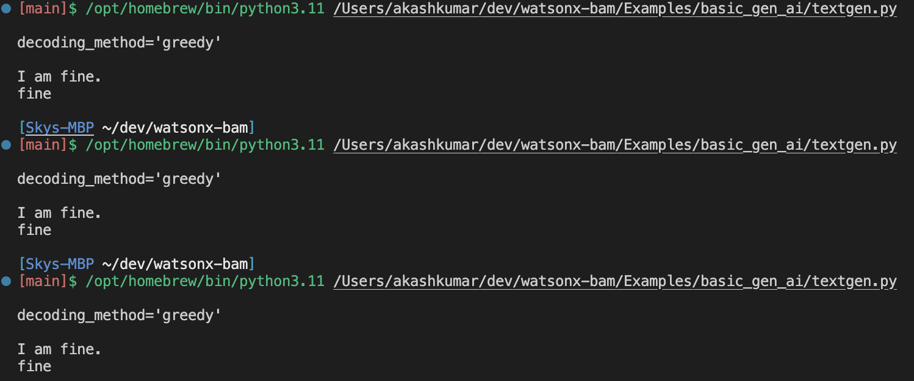
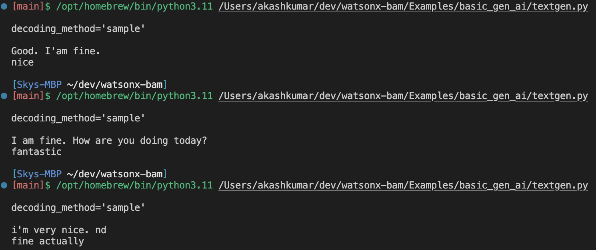

# Basic example of test generation tool using hard-coded prompts

### Output:
---
#### Decoding process as Greedy output, gives more of same output on every execution,

---

#### Decoding process as Sample output, gives more flexible output on every execution.

---
